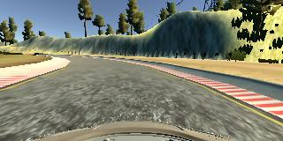
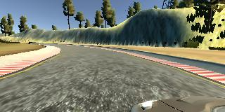
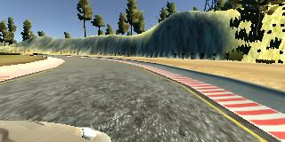

# Behavioral Cloning
<!---
##Writeup Template

###You can use this file as a template for your writeup if you want to submit it as a markdown file, but feel free to use some other method and submit a pdf if you prefer.

---

**Behavioral Cloning Project**

The goals / steps of this project are the following:
* Use the simulator to collect data of good driving behavior
* Build, a convolution neural network in Keras that predicts steering angles from images
* Train and validate the model with a training and validation set
* Test that the model successfully drives around track one without leaving the road
* Summarize the results with a written report


[//]: # (Image References)

[image1]: ./examples/placeholder.png "Model Visualization"
[image2]: ./examples/placeholder.png "Grayscaling"
[image3]: ./examples/placeholder_small.png "Recovery Image"
[image4]: ./examples/placeholder_small.png "Recovery Image"
[image5]: ./examples/placeholder_small.png "Recovery Image"
[image6]: ./examples/placeholder_small.png "Normal Image"
[image7]: ./examples/placeholder_small.png "Flipped Image"
-->
## Rubric Points
<!---
###Here I will consider the [rubric points](https://review.udacity.com/#!/rubrics/432/view) individually and describe how I addressed each point in my implementation.  
-->
---
### Files Submitted & Code Quality
#### 1. Submission includes all required files and can be used to run the simulator in autonomous mode

My project includes the following files:
* [model.py containing the script to create and train the model](https://github.com/autohandle/CarNDBehavioralCloningP3/blob/master/BehavioralCloning.ipynb)
* [drive.py for driving the car in autonomous mode](https://github.com/autohandle/CarNDBehavioralCloningP3/blob/master/drive.py)
* [model.h5 containing a trained convolution neural network](https://github.com/autohandle/CarNDBehavioralCloningP3/blob/master/2017_07_10_23_21.model)
* [writeup_report.md or writeup_report.pdf summarizing the results](http://ec2-54-156-49-232.compute-1.amazonaws.com:8888/notebooks/CarND-Behavioral-Cloning-P3/Writeup.md.ipynb)
* and [a video](https://github.com/autohandle/CarNDBehavioralCloningP3/blob/master/VIDEO.mp4)

#### 2. Submission includes functional code
Using the Udacity provided simulator and my drive.py file, the car can be driven autonomously around the track by executing 
```sh
python ./drive.py 2017_07_10_23_21.model
```

#### 3. Submission code is usable and readable

The [BehavioralCloning.ipynb](https://github.com/autohandle/CarNDBehavioralCloningP3/blob/master/BehavioralCloning.ipynb) file contains the code for training and saving the convolution neural network.
The file shows the pipeline I used for training and validating the model, 
and since the code was covered in detail in the class, it contains only a few comments to explain how the code works.

### Model Architecture and Training Strategy

#### 1. An appropriate model architecture has been employed

My model is the nvidia neural network model mentioned in class and consists of 5 convolution layers followed by 3 dense layers

```python
# nvidia model
model.add(Convolution2D(24, 5, 5, subsample=(2,2), activation="relu"))
model.add(Convolution2D(36, 5, 5, subsample=(2,2), activation="relu"))
model.add(Convolution2D(48, 5, 5, subsample=(2,2), activation="relu"))
model.add(Convolution2D(64, 3, 3, activation="relu"))
model.add(Convolution2D(64, 3, 3, activation="relu"))
model.add(Flatten())
model.add(Dense(100))
model.add(Dense(50))
model.add(Dense(10))
```

The model includes RELU layers to introduce nonlinearity, and the data is normalized in the model using a Keras lambda layer:

```python
model = Sequential()
model.add(Lambda(lambda x: (x / 255.0) - 0.5, input_shape=XtrainInputShape))
```

#### 2. Attempts to reduce overfitting in the model

Before being replaced by the nvidia model, the LeNet model was used and it contained dropout layers
in order to reduce overfitting:

```python
# add lenet
model.add(Convolution2D(10, 5, 5, input_shape=XtrainInputShape, activation="relu"))
model.add(MaxPooling2D())
model.add(Convolution2D(6, 5, 5, activation="relu"))
model.add(MaxPooling2D())
model.add(Flatten())
model.add(Dropout(.25))
model.add(Dense(120))
model.add(Dropout(.25))
model.add(Dense(84))
```

Using the *validation_split* parameter, the model was trained on 80% of the data and validated on 20% of the data to reduce overfitting:

```python
adamOptimizer=keras.optimizers.Adam(lr=0.0001)
model.compile(optimizer=adamOptimizer, loss='mse', metrics=['accuracy'])
model.fit(X_train, y_train, validation_split=0.2, shuffle=True, nb_epoch=4)
```
The model was very sensitive to overfitting and reducing the number of epochs seemed to be the primary way
to stop the training when the model started overfitting.

The model was tested by running it through the simulator and ensuring that the vehicle could stay on the track.

#### 3. Model parameter tuning

The model used an adam optimizer. In the final training pass, the learning rate was reduced to 0.0001 using the lr (LR) parameter.

#### 4. Appropriate training data

Training data was chosen to keep the vehicle driving on the road. I used a combination of center lane driving, recovering from the left and right sides of the road,
but I did not have enough memory to flip the images.

For details about how I created the training data, see the next section. 

### Model Architecture and Training Strategy

#### 1. Solution Design Approach

The overall strategy for deriving a model architecture was to follow the class lessons.

My first step was to use a LeNet convolution neural network model.

```python
X_train.shape: (32511, 160, 320, 3) y_train.shape: (32511,)
X_train[0].shape: (160, 320, 3)

model.add(Convolution2D(10, 5, 5, input_shape=XtrainInputShape, activation="relu"))
model.add(MaxPooling2D())
model.add(Convolution2D(6, 5, 5, activation="relu"))
model.add(MaxPooling2D())
model.add(Flatten())
model.add(Dropout(.25))
model.add(Dense(120))
model.add(Dropout(.25))
model.add(Dense(84))
```

In order to gauge how well the model was working, I split my image and steering angle data into a training and validation set.

```python
XtrainInputShape: (160, 320, 3)
Train on 26008 samples, validate on 6503 samples
Epoch 1/10
26008/26008 [==============================] - 122s - loss: 0.0447 - acc: 0.2373 - val_loss: 0.0262 - val_acc: 0.2488
Epoch 2/10
26008/26008 [==============================] - 118s - loss: 0.0168 - acc: 0.2387 - val_loss: 0.0257 - val_acc: 0.2488
Epoch 3/10
26008/26008 [==============================] - 118s - loss: 0.0149 - acc: 0.2387 - val_loss: 0.0266 - val_acc: 0.2488
Epoch 4/10
26008/26008 [==============================] - 119s - loss: 0.0138 - acc: 0.2388 - val_loss: 0.0281 - val_acc: 0.2488
Epoch 5/10
26008/26008 [==============================] - 119s - loss: 0.0134 - acc: 0.2388 - val_loss: 0.0272 - val_acc: 0.2488
Epoch 6/10
26008/26008 [==============================] - 119s - loss: 0.0132 - acc: 0.2390 - val_loss: 0.0278 - val_acc: 0.2485
Epoch 7/10
26008/26008 [==============================] - 119s - loss: 0.0129 - acc: 0.2389 - val_loss: 0.0276 - val_acc: 0.2487
Epoch 8/10
26008/26008 [==============================] - 119s - loss: 0.0126 - acc: 0.2390 - val_loss: 0.0250 - val_acc: 0.2488
Epoch 9/10
26008/26008 [==============================] - 119s - loss: 0.0124 - acc: 0.2390 - val_loss: 0.0299 - val_acc: 0.2483
Epoch 10/10
26008/26008 [==============================] - 119s - loss: 0.0117 - acc: 0.2390 - val_loss: 0.0269 - val_acc: 0.2488
saving model as: 2017_07_10_20_52.model
```

I found that my first model had a decreasing mean squared error on the training set but a constant or increasing squared error on the validation set.
This implied that the model was overfitting. In addition, the car decide to hump the right hand side of the bridge as it went across.

To combat the overfitting, I modified the model to reduce the number of epochs.

```python
XtrainInputShape: (160, 320, 3)
Train on 26008 samples, validate on 6503 samples
Epoch 1/3
26008/26008 [==============================] - 120s - loss: 0.1064 - acc: 0.2365 - val_loss: 0.0261 - val_acc: 0.2488
Epoch 2/3
26008/26008 [==============================] - 119s - loss: 0.0177 - acc: 0.2387 - val_loss: 0.0265 - val_acc: 0.2488
Epoch 3/3
26008/26008 [==============================] - 119s - loss: 0.0157 - acc: 0.2387 - val_loss: 0.0258 - val_acc: 0.2488
saving model as: 2017_07_10_21_11.model
```

This time the car humped the left hand side of the bridge. To increase the number of image samples,
I followed the class lesson and add the left and right camera and included a steering correction:
    
```python
STEERINGMEASUEMENT=3
CAMERAS=3
STERRINGADJUSTMENT=[0, .3, -.3]
...
for line in lines:
    for camera in range(CAMERAS):
    ...
    steeringMeasurements.append(float(line[STEERINGMEASUEMENT])+STERRINGADJUSTMENT[camera])
    
```

XtrainInputShape: (160, 320, 3)
Train on 26008 samples, validate on 6503 samples
Epoch 1/5
26008/26008 [==============================] - 121s - loss: 0.6141 - acc: 0.2304 - val_loss: 0.0276 - val_acc: 0.2483
Epoch 2/5
26008/26008 [==============================] - 118s - loss: 0.0234 - acc: 0.2364 - val_loss: 0.0248 - val_acc: 0.2483
Epoch 3/5
26008/26008 [==============================] - 118s - loss: 0.0205 - acc: 0.2365 - val_loss: 0.0247 - val_acc: 0.2483
Epoch 4/5
26008/26008 [==============================] - 119s - loss: 0.0192 - acc: 0.2365 - val_loss: 0.0246 - val_acc: 0.2483
Epoch 5/5
26008/26008 [==============================] - 119s - loss: 0.0174 - acc: 0.2365 - val_loss: 0.0259 - val_acc: 0.2483
saving model as: 2017_07_10_21_32.model
```

Continuing to follow the class lesson I cropped the images in the pipeline:
    
```python
model.add(Cropping2D(cropping=((70,25),(0,0))))
```

```python
XtrainInputShape: (160, 320, 3)
Train on 26008 samples, validate on 6503 samples
Epoch 1/6
26008/26008 [==============================] - 61s - loss: 0.0331 - acc: 0.2360 - val_loss: 0.0552 - val_acc: 0.2483
Epoch 2/6
26008/26008 [==============================] - 61s - loss: 0.0269 - acc: 0.2364 - val_loss: 0.0553 - val_acc: 0.2483
Epoch 3/6
26008/26008 [==============================] - 61s - loss: 0.0254 - acc: 0.2363 - val_loss: 0.0585 - val_acc: 0.2448: 0.0255 - acc:  - ETA: 1s - los
Epoch 4/6
26008/26008 [==============================] - 61s - loss: 0.0241 - acc: 0.2365 - val_loss: 0.0445 - val_acc: 0.2483
Epoch 5/6
26008/26008 [==============================] - 60s - loss: 0.0233 - acc: 0.2365 - val_loss: 0.0548 - val_acc: 0.2477
Epoch 6/6
26008/26008 [==============================] - 61s - loss: 0.0227 - acc: 0.2366 - val_loss: 0.0529 - val_acc: 0.2474
saving model as: 2017_07_10_22_20.model
```

this made the situation even worse, the car didn't even make it to the bridge.
I then follow the next class lesson and switched to the nvidia model:
    
```python
# nvidia model
model.add(Convolution2D(24, 5, 5, subsample=(2,2), activation="relu"))
model.add(Convolution2D(36, 5, 5, subsample=(2,2), activation="relu"))
model.add(Convolution2D(48, 5, 5, subsample=(2,2), activation="relu"))
model.add(Convolution2D(64, 3, 3, activation="relu"))
model.add(Convolution2D(64, 3, 3, activation="relu"))
model.add(Flatten())
model.add(Dense(100))
model.add(Dense(50))
model.add(Dense(10))
```

```python
XtrainInputShape: (160, 320, 3)
Train on 26008 samples, validate on 6503 samples
Epoch 1/4
26008/26008 [==============================] - 58s - loss: 0.0302 - acc: 0.2363 - val_loss: 0.0460 - val_acc: 0.2483
Epoch 2/4
26008/26008 [==============================] - 58s - loss: 0.0234 - acc: 0.2365 - val_loss: 0.0492 - val_acc: 0.2483
Epoch 3/4
26008/26008 [==============================] - 58s - loss: 0.0197 - acc: 0.2365 - val_loss: 0.0478 - val_acc: 0.2483
Epoch 4/4
26008/26008 [==============================] - 58s - loss: 0.0171 - acc: 0.2367 - val_loss: 0.0507 - val_acc: 0.2483
saving model as: 2017_07_10_22_50.model
```

With the nvidia model, the car went completely around the track, only just touching the yellow lane marker late in the circuit.
Hoping that I was close to a good model, I modified the learning rate:
    
```python
adamOptimizer=keras.optimizers.Adam(lr=0.0001)
model.compile(optimizer=adamOptimizer, loss='mse', metrics=['accuracy'])
model.fit(X_train, y_train, validation_split=0.2, shuffle=True, nb_epoch=4)
```

```python
XtrainInputShape: (160, 320, 3)
Train on 26008 samples, validate on 6503 samples
Epoch 1/4
26008/26008 [==============================] - 58s - loss: 0.0300 - acc: 0.2364 - val_loss: 0.0517 - val_acc: 0.2483
Epoch 2/4
26008/26008 [==============================] - 58s - loss: 0.0234 - acc: 0.2365 - val_loss: 0.0544 - val_acc: 0.2482
Epoch 3/4
26008/26008 [==============================] - 58s - loss: 0.0206 - acc: 0.2365 - val_loss: 0.0581 - val_acc: 0.2482
Epoch 4/4
26008/26008 [==============================] - 58s - loss: 0.0186 - acc: 0.2366 - val_loss: 0.0464 - val_acc: 0.2482
saving model as: 2017_07_10_23_21.model
```

This was the final step, the vehicle is able to drive autonomously around the track without leaving the road. Woo Hoo!!

#### 2. Final Model Architecture

The final model architecture was the nvidia model presented in class which consisted of
preprocessing the images with normalization and cropping, and a pipeline that consisted of
5 convolution neural networks followed by 3 dense layers feeding a final dense regression layer.

```python
model = Sequential()

model.add(Lambda(lambda x: (x / 255.0) - 0.5, input_shape=XtrainInputShape))
model.add(Cropping2D(cropping=((70,25),(0,0))))

# nvidia model
model.add(Convolution2D(24, 5, 5, subsample=(2,2), activation="relu"))
model.add(Convolution2D(36, 5, 5, subsample=(2,2), activation="relu"))
model.add(Convolution2D(48, 5, 5, subsample=(2,2), activation="relu"))
model.add(Convolution2D(64, 3, 3, activation="relu"))
model.add(Convolution2D(64, 3, 3, activation="relu"))
model.add(Flatten())
model.add(Dense(100))
model.add(Dense(50))
model.add(Dense(10))

##
model.add(Dense(1))
```
<!---
Here is a visualization of the architecture (note: visualizing the architecture is optional according to the project rubric)
-->

#### 3. Creation of the Training Set & Training Process

To capture good driving behavior, I first recorded **one** lap in **each** direction on track one using center lane driving.
Here is an example image of center lane driving:



I then recorded the vehicle recovering from the left side and right sides
of the road back to center so that the vehicle would learn to recover when it veered from the center of the road.
These images show what a recovery looks like:




Since I initially drove the car in both training directions (clockwise and counter clockwise),
I was memory constrained and did **not** attempt to get more data points by flipping the images.

#### 3. Video of the Final Model Driving Car On Track 1 (click to play)

[](http://www.autohandle.com/video/VIDEO.mp4)
